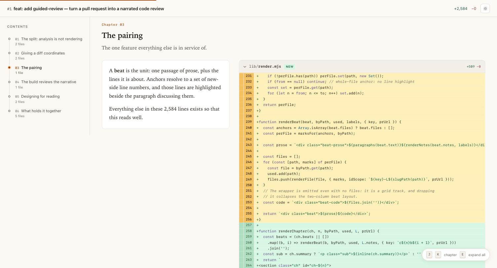
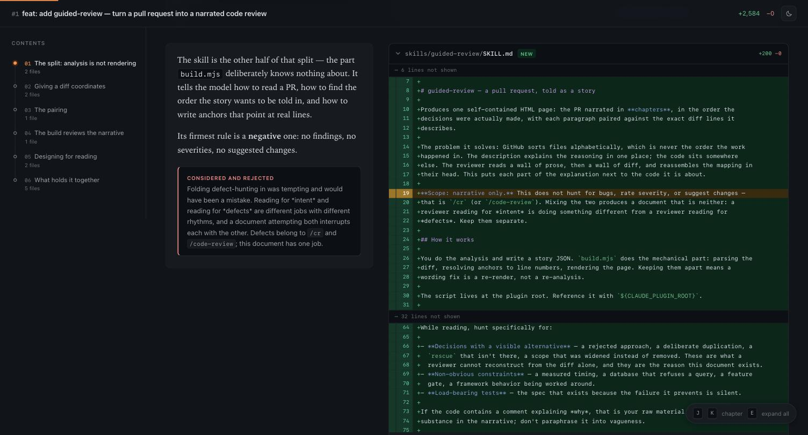
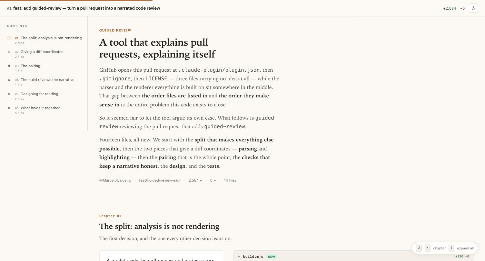

# guided-review

**Make code review great again.**

Turn a pull request into a guided, narrated code review — one self-contained HTML page where
the PR is told as a story, in the order the decisions were made, with each paragraph sitting
beside the exact diff lines it explains.



---

## Let's be honest about code review

Nobody's favourite part of the week.

It used to be survivable. A couple of PRs, most of them small, written by someone whose
reasoning you could reconstruct — or just ask about. Then something changed: **writing code got
dramatically cheaper, and reading it didn't.**

The bottleneck moved. It's no longer "how fast can we ship this" — it's "who has three
uninterrupted hours to understand what this actually does." And here's the uncomfortable part:
the code is often *fine*. Well structured, tested, idiomatic. That's not the problem. The
problem is **volume against a fixed budget of human attention**.

So what actually happens, in every team, every week:

- You open a 40-file PR at 4pm.
- GitHub greets you with `.eslintrc` and `.gitignore`, because it sorts alphabetically and has
  no idea which file carries the idea.
- The description explains the reasoning beautifully — in one place, 800 words, scrolled far
  away from any of the code it describes.
- You read the prose. You read the diff. You try to hold the mapping between them in your head.
- Somewhere around file 18, the honest part of your brain goes quiet and you start **scrolling
  faster**.
- ✅ LGTM.

That last step is the expensive one. Not because reviewers are lazy — because **reconstructing
intent from a diff is genuinely hard work**, and we ask people to redo it from scratch for every
PR, after the author already did it and wrote it down somewhere else.

Skimming doesn't miss the bugs a linter catches. It misses the ones that need someone awake
enough to ask *"wait, why is it done this way?"*

### The bet

The fix isn't a better diff viewer, and it isn't asking reviewers to try harder.

It's putting the explanation **next to the code it explains**, in the order the decisions were
actually made — so that following the reasoning costs *less* than skipping it.

A big PR stops being a wall of unfamiliar code and becomes something closer to a well-written
article about a codebase you happen to work on. You still review. You just get to enjoy it.

---

## What it does

- 📖 **Chapters, not files** — ordered by what you need to understand first, never alphabetically
- 🔗 **Prose anchored to lines** — each paragraph sits beside the exact passage it describes, highlighted
- 💡 **The reasoning, made explicit** — `why`, `trade-off` and `considered and rejected` callouts
- ✂️ **Focused panels** — an 800-line file shows the passage under discussion, and says how much it skipped
- 🧭 **A reading order that exists** — chapter rail, progress, `J`/`K` navigation
- 📦 **One HTML file** — no network, no assets, no build step; opens offline
- 🤖 Installable as a [Claude Code](https://docs.claude.com/en/docs/claude-code) skill



Above: a `considered and rejected` callout next to the exact line where the decision lives —
plus two `lines not shown` markers, because a tool that hides code from reviewers to save space
would be arguing against itself.

---

## See it working

This tool reviewing the pull request that adds this tool:

**→ [the raw PR on GitHub](https://github.com/MarceloCajueiro/guided-review/pull/1)**

Open it and look at the file list: `.claude-plugin/plugin.json`, `.gitignore`, `LICENSE` — three
files carrying no idea at all, before anything that matters. Then look at the guided version:



---

## Requirements

- [Node](https://nodejs.org) v18+ — no `npm install`, zero dependencies
- [GitHub CLI](https://cli.github.com) (`gh`) authenticated with access to the repo

## Quick start

As a Claude Code skill — the intended path, since writing the narrative is the part that needs
a reader:

```
/guided-review 3649
```

Claude reads the PR and its diff, works out the order the story should be told in, writes the
narrative, builds the page, and opens it.

Standalone, if you already have a story JSON:

```bash
gh pr diff 3649 > pr.diff
node build.mjs story.json pr.diff --out review.html
```

### Options

| Option | Default | What it does |
|---|---|---|
| `--out <file>` | `guided-review-<pr>.html` | Output path. |
| `--lang <code>` | `en` | UI labels only (`en` or `pt`). The narrative renders in whatever language it was written in. |
| `--help` | | Usage. |

---

## How it works

A model reads the PR and writes a **story JSON**. `build.mjs` does the mechanical part —
parsing the diff, resolving anchors to line numbers, rendering the page. Nothing in the script
does analysis.

That split is why a wording fix is a re-render instead of a re-read of a 2,000-line diff. It's
also what lets the build *check* the narrative instead of just printing it.

### The unit is a beat

A chapter groups beats; a beat is one passage of prose plus the lines it's about.

```jsonc
{
  "number": 3649,
  "title": "Data readiness onboarding",
  "url": "https://github.com/org/repo/pull/3649",
  "headline": "The panel said \"1 family\" where there were hundreds",
  "lede": "The problem, and how to read this page.",
  "chapters": [
    {
      "title": "One definition of \"pending\"",
      "beats": [
        {
          "text": "Each check declares **two** forms of itself: how it is counted, and how it is listed…",
          "files": ["app/services/readiness_checks.rb:17-42"],
          "notes": [
            { "kind": "why", "text": "Two representations of one rule diverge silently…" }
          ]
        }
      ]
    }
  ]
}
```

**Anchors** are what make the pairing work:

| Anchor | Effect |
|---|---|
| `path/to/file.rb:17-42` | Highlights those new-side lines; the panel focuses on that passage. |
| `path/to/file.rb:42` | A single line. |
| `path/to/file.rb` | The whole file, no highlight — for one-line includes. |

**Notes** carry what a diff cannot: `why` (the reasoning behind a decision that had an
alternative), `tradeoff` (what was knowingly given up), `rejected` (an approach dropped, and
why).

---

## The build reviews your narrative

It's not just a renderer. It refuses malformed input, and it flags the failures that would
otherwise ship silently — the dangerous kind, because the output still *looks* trustworthy:

```
warning: anchor "app/foo.rb:120-140" matches no line in the new file
```

Somebody guessed a line number instead of reading it off the diff. A wrong-but-valid number
confidently highlights the wrong code and nothing complains.

```
warning: 2 substantial file(s) have no place in the narrative.
  - app/helpers/readiness_helper.rb (+49 −0)
```

Uncovered files land in an appendix. Right for `db/structure.sql` and one-line includes —
wrong for a new 49-line helper, which the page would then present as carrying no decision worth
explaining. Silence about a file is itself a claim; this makes the narrator prove it.

Pointed at a real 27-file PR, that check caught five skipped files on the first run. Pointed at
this project's own PR, it caught the README.

Ranges that cannot mean anything — running backwards, starting below line 1 — are rejected
outright rather than warned about, because every one of them produces an empty highlight that
looks exactly like a correct one.

---

## Reading the page

- **J / K** (or ← / →) move between chapters; **E** expands or collapses every file
- The left rail tracks where you are; the hairline at the top is reading progress
- Light and dark follow the OS, with a toggle that overrides and persists
- Line-anchored panels show that passage plus context, and **always say how much they skipped**
- Generated files (`structure.sql`, lockfiles, `dist/`, `vendor/`) are detected and collapsed

---

## What it is not

**Not a code review.** No findings, no severity ratings, no suggested changes. Reading for
*intent* and reading for *defects* are different jobs, and a document that tries to be both
serves neither. For defects, use [`agentic-cr`](https://github.com/MarceloCajueiro/agentic-cr)
or Claude Code's built-in `/code-review`.

**Not a substitute for reading the code.** It's a reading order and an explanation — you still
review. That's the point: it makes the reviewing part worth doing properly.

---

## Tests

```bash
npm test
```

`node:test`, no dependencies. The suite covers the places where a silent bug produces a
confidently wrong page: line-number tracking in the parser, class mapping in the highlighter,
and — most importantly — that **every hidden line is accounted for** by a marker. A guided
review that quietly drops code is worse than no guided review at all.

---

## Install

```bash
git clone https://github.com/MarceloCajueiro/guided-review.git
```

Then add it as a plugin directory in Claude Code, and `/guided-review` becomes available.

---

## License

MIT © Marcelo Cajueiro — [cajueiro.tech](https://cajueiro.tech)
